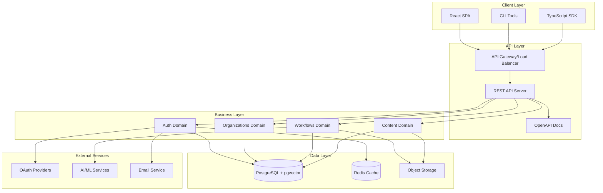
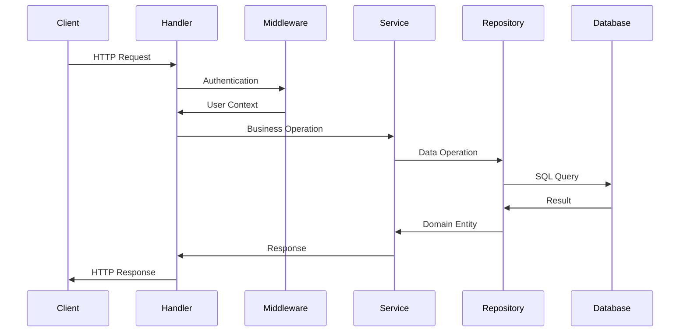
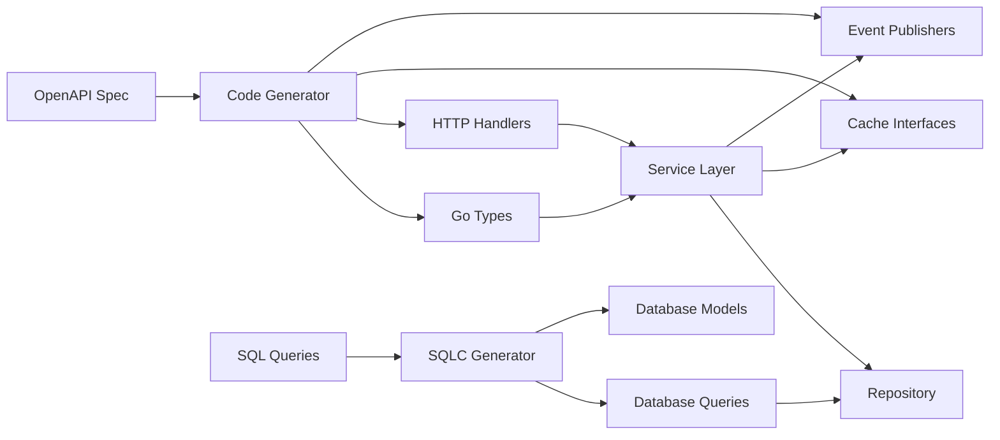
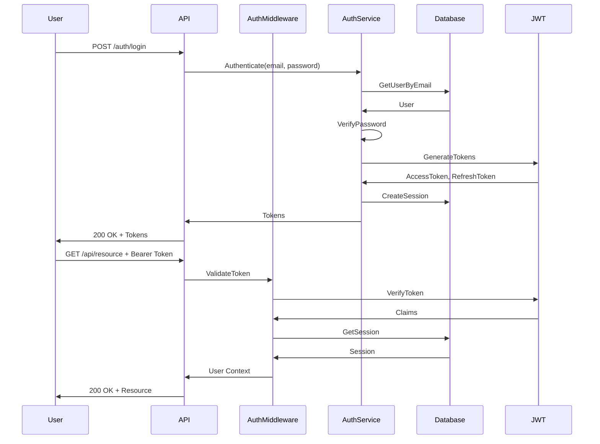

# Architecture Documentation

## Overview

ArchesAI implements **Hexagonal Architecture** (Ports & Adapters) with **Domain-Driven Design** principles, ensuring separation of concerns, testability, and business logic independence from infrastructure.

## Core Principles

### Hexagonal Architecture

- **Core Domain**: Business logic and rules
- **Ports**: Interfaces defining external interactions
- **Adapters**: Implementations connecting to external systems

### Dependency Rule

Dependencies flow inward toward the domain core:

```
External World → Adapters → Ports → Domain Core
```

### Domain Isolation

Each bounded context (auth, organizations, workflows, content) operates independently with:

- Own entities and business rules
- Dedicated database tables
- Separate API endpoints
- No cross-domain imports

## System Architecture

### High-Level Components



### Request Flow



## Domain Architecture

### Flat Package Structure

Each domain follows a flat package structure for simplicity:

```
internal/auth/
├── auth.go                    # Package documentation, constants, errors
├── service.go                 # Business logic and use cases
├── handler.go                 # HTTP request handlers
├── http.gen.go                # Generated HTTP server interface
├── middleware_http.go         # HTTP middleware (auth domain only)
├── repository_postgres.go     # PostgreSQL repository implementation
├── repository_sqlite.go       # SQLite repository implementation
├── repository.gen.go          # Generated repository interface
├── types.gen.go               # Generated OpenAPI types
├── cache.gen.go               # Generated cache interface
├── cache_memory.gen.go        # In-memory cache implementation
├── cache_redis.gen.go         # Redis cache implementation
├── events.gen.go              # Generated event definitions
├── events_redis.gen.go        # Redis event publisher
└── events_nats.gen.go         # NATS event publisher
```

### Service Layer Pattern

The service layer orchestrates business operations:

```go
type Service struct {
    repo   Repository      // Data persistence
    cache  Cache          // Performance optimization
    events EventPublisher // Event-driven communication
}

// Business operation example
func (s *Service) CreateUser(ctx context.Context, req CreateUserRequest) (*User, error) {
    // 1. Validate business rules
    if err := s.validateUserCreation(req); err != nil {
        return nil, err
    }

    // 2. Execute business logic
    user := &User{
        ID:    uuid.New(),
        Email: req.Email,
        Name:  req.Name,
    }

    // 3. Persist to repository
    if err := s.repo.CreateUser(ctx, user); err != nil {
        return nil, err
    }

    // 4. Update cache
    _ = s.cache.SetUser(ctx, user, 5*time.Minute)

    // 5. Publish domain event
    _ = s.events.PublishUserCreated(ctx, user)

    return user, nil
}
```

### Repository Pattern

Repositories abstract data persistence:

```go
// Port (interface) defined by domain
type Repository interface {
    CreateUser(ctx context.Context, user *User) error
    GetUserByID(ctx context.Context, id uuid.UUID) (*User, error)
    GetUserByEmail(ctx context.Context, email string) (*User, error)
    UpdateUser(ctx context.Context, user *User) error
    DeleteUser(ctx context.Context, id uuid.UUID) error
}

// Adapter (implementation) in infrastructure
type PostgresRepository struct {
    queries *postgresql.Queries
}

func (r *PostgresRepository) CreateUser(ctx context.Context, user *User) error {
    _, err := r.queries.CreateUser(ctx, postgresql.CreateUserParams{
        Id:           user.ID.String(),
        Email:        user.Email,
        Name:         user.Name,
        PasswordHash: user.PasswordHash,
    })
    return err
}
```

## Data Flow Architecture

### Code Generation Pipeline



### Authentication Flow



## Database Architecture

### Schema Design

```sql
-- Multi-tenant foundation
CREATE TABLE organizations (
    id UUID PRIMARY KEY,
    name VARCHAR(255) NOT NULL,
    plan VARCHAR(50) DEFAULT 'free',
    credits INTEGER DEFAULT 0,
    created_at TIMESTAMP DEFAULT CURRENT_TIMESTAMP
);

-- User management
CREATE TABLE users (
    id UUID PRIMARY KEY,
    email VARCHAR(255) UNIQUE NOT NULL,
    name VARCHAR(255) NOT NULL,
    password_hash VARCHAR(255),
    created_at TIMESTAMP DEFAULT CURRENT_TIMESTAMP
);

-- Organization membership
CREATE TABLE members (
    id UUID PRIMARY KEY,
    user_id UUID REFERENCES users(id),
    organization_id UUID REFERENCES organizations(id),
    role VARCHAR(50) NOT NULL,
    UNIQUE(user_id, organization_id)
);

-- Session management
CREATE TABLE sessions (
    token VARCHAR(255) PRIMARY KEY,
    user_id UUID REFERENCES users(id),
    expires_at TIMESTAMP NOT NULL,
    active_organization_id UUID REFERENCES organizations(id)
);

-- Content storage with vectors
CREATE TABLE artifacts (
    id UUID PRIMARY KEY,
    organization_id UUID REFERENCES organizations(id),
    name VARCHAR(255) NOT NULL,
    content TEXT,
    embedding vector(1536),  -- pgvector for similarity search
    metadata JSONB,
    created_at TIMESTAMP DEFAULT CURRENT_TIMESTAMP
);

-- Workflow definitions
CREATE TABLE pipelines (
    id UUID PRIMARY KEY,
    organization_id UUID REFERENCES organizations(id),
    name VARCHAR(255) NOT NULL,
    definition JSONB NOT NULL,  -- DAG structure
    created_at TIMESTAMP DEFAULT CURRENT_TIMESTAMP
);

-- Workflow executions
CREATE TABLE runs (
    id UUID PRIMARY KEY,
    pipeline_id UUID REFERENCES pipelines(id),
    status VARCHAR(50) NOT NULL,
    progress DECIMAL(5,2) DEFAULT 0,
    started_at TIMESTAMP DEFAULT CURRENT_TIMESTAMP,
    completed_at TIMESTAMP
);
```

### Indexing Strategy

```sql
-- Performance indexes
CREATE INDEX idx_users_email ON users(email);
CREATE INDEX idx_sessions_token ON sessions(token);
CREATE INDEX idx_sessions_user_id ON sessions(user_id);
CREATE INDEX idx_members_user_org ON members(user_id, organization_id);
CREATE INDEX idx_artifacts_org ON artifacts(organization_id);
CREATE INDEX idx_pipelines_org ON pipelines(organization_id);
CREATE INDEX idx_runs_pipeline ON runs(pipeline_id);
CREATE INDEX idx_runs_status ON runs(status);

-- Vector similarity search
CREATE INDEX idx_artifacts_embedding ON artifacts
USING ivfflat (embedding vector_cosine_ops)
WITH (lists = 100);
```

## Caching Architecture

### Cache Layers

1. **Application Cache** (Redis)
   - Session data
   - User profiles
   - Organization metadata
   - Temporary computation results

2. **Database Cache** (PostgreSQL)
   - Query result caching
   - Prepared statement caching
   - Connection pooling

3. **CDN Cache** (CloudFlare/CloudFront)
   - Static assets
   - API responses for public data

### Cache Patterns

```go
// Cache-Aside Pattern
func (s *Service) GetUser(ctx context.Context, id uuid.UUID) (*User, error) {
    // Try cache first
    user, err := s.cache.GetUser(ctx, id)
    if err == nil {
        return user, nil
    }

    // Cache miss - get from database
    user, err = s.repo.GetUserByID(ctx, id)
    if err != nil {
        return nil, err
    }

    // Update cache for next time
    _ = s.cache.SetUser(ctx, user, 5*time.Minute)

    return user, nil
}

// Write-Through Pattern
func (s *Service) UpdateUser(ctx context.Context, user *User) error {
    // Update database
    if err := s.repo.UpdateUser(ctx, user); err != nil {
        return err
    }

    // Update cache
    _ = s.cache.SetUser(ctx, user, 5*time.Minute)

    // Publish update event
    _ = s.events.PublishUserUpdated(ctx, user)

    return nil
}
```

## Security Architecture

### Defense in Depth

1. **Network Layer**
   - TLS/HTTPS encryption
   - Rate limiting
   - DDoS protection

2. **Application Layer**
   - JWT authentication
   - CORS configuration
   - Input validation
   - SQL injection prevention (via SQLC)

3. **Data Layer**
   - Encryption at rest
   - Row-level security
   - Audit logging

### Authentication & Authorization

```go
// JWT Claims Structure
type Claims struct {
    UserID         uuid.UUID `json:"user_id"`
    Email          string    `json:"email"`
    OrganizationID uuid.UUID `json:"organization_id"`
    Role           string    `json:"role"`
    jwt.StandardClaims
}

// Middleware for protected routes
func AuthMiddleware(jwtSecret string) echo.MiddlewareFunc {
    return func(next echo.HandlerFunc) echo.HandlerFunc {
        return func(c echo.Context) error {
            // Extract token
            token := extractToken(c.Request())

            // Validate token
            claims, err := validateToken(token, jwtSecret)
            if err != nil {
                return echo.NewHTTPError(http.StatusUnauthorized)
            }

            // Set user context
            c.Set("user", claims)

            return next(c)
        }
    }
}

// Role-based access control
func RequireRole(roles ...string) echo.MiddlewareFunc {
    return func(next echo.HandlerFunc) echo.HandlerFunc {
        return func(c echo.Context) error {
            claims := c.Get("user").(*Claims)

            for _, role := range roles {
                if claims.Role == role {
                    return next(c)
                }
            }

            return echo.NewHTTPError(http.StatusForbidden)
        }
    }
}
```

## Scalability Considerations

### Horizontal Scaling

- **Stateless API servers** - Can scale horizontally behind load balancer
- **Database read replicas** - Distribute read load
- **Redis clustering** - Distributed caching
- **Queue-based processing** - Async job processing

### Performance Optimizations

1. **Connection Pooling**

   ```go
   db.SetMaxOpenConns(25)
   db.SetMaxIdleConns(5)
   db.SetConnMaxLifetime(5 * time.Minute)
   ```

2. **Batch Processing**

   ```go
   // Process in batches to avoid memory issues
   const batchSize = 100
   for i := 0; i < len(items); i += batchSize {
       end := i + batchSize
       if end > len(items) {
           end = len(items)
       }
       processBatch(items[i:end])
   }
   ```

3. **Concurrent Processing**

   ```go
   // Use worker pool pattern
   jobs := make(chan Job, 100)
   results := make(chan Result, 100)

   // Start workers
   for w := 1; w <= numWorkers; w++ {
       go worker(jobs, results)
   }

   // Send jobs
   for _, job := range allJobs {
       jobs <- job
   }
   close(jobs)
   ```

## Monitoring & Observability

### Metrics Collection

- **Application Metrics** (Prometheus)
  - Request latency
  - Error rates
  - Business metrics

- **Infrastructure Metrics** (Grafana)
  - CPU/Memory usage
  - Database connections
  - Cache hit rates

### Logging Strategy

```go
// Structured logging with context
logger.Info("Processing request",
    zap.String("request_id", requestID),
    zap.String("user_id", userID),
    zap.String("action", "create_artifact"),
    zap.Duration("duration", duration),
)
```

### Distributed Tracing

- OpenTelemetry integration
- Request correlation IDs
- Cross-service tracing

## Deployment Architecture

### Container Strategy

```dockerfile
# Multi-stage build
FROM golang:1.21-alpine AS builder
WORKDIR /app
COPY . .
RUN go build -o archesai cmd/archesai/main.go

FROM alpine:latest
RUN apk --no-cache add ca-certificates
COPY --from=builder /app/archesai /archesai
EXPOSE 8080
CMD ["/archesai"]
```

### Kubernetes Deployment

```yaml
apiVersion: apps/v1
kind: Deployment
metadata:
  name: archesai-api
spec:
  replicas: 3
  selector:
    matchLabels:
      app: archesai-api
  template:
    metadata:
      labels:
        app: archesai-api
    spec:
      containers:
        - name: api
          image: archesai/api:latest
          ports:
            - containerPort: 8080
          env:
            - name: ARCHESAI_DATABASE_URL
              valueFrom:
                secretKeyRef:
                  name: archesai-secrets
                  key: database-url
          resources:
            requests:
              memory: "256Mi"
              cpu: "250m"
            limits:
              memory: "512Mi"
              cpu: "500m"
```

## Future Considerations

### Planned Enhancements

1. **GraphQL API** - Alternative query interface
2. **gRPC Services** - Internal service communication
3. **Event Sourcing** - Audit trail and replay capability
4. **CQRS Pattern** - Separate read/write models
5. **Service Mesh** - Istio/Linkerd for microservices
6. **Multi-region** - Geographic distribution

### Technology Evaluations

- **Message Queue**: Kafka vs NATS vs RabbitMQ
- **Search Engine**: Elasticsearch vs Meilisearch
- **Time Series DB**: InfluxDB vs TimescaleDB
- **Graph Database**: Neo4j vs DGraph
