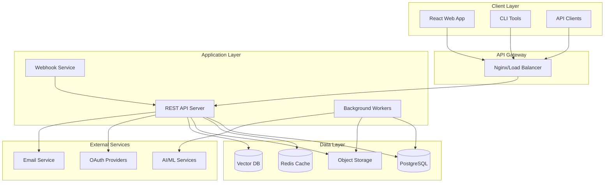
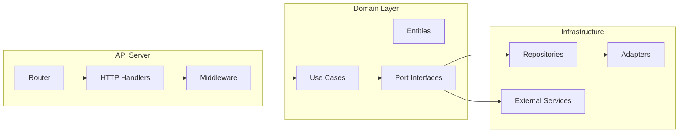
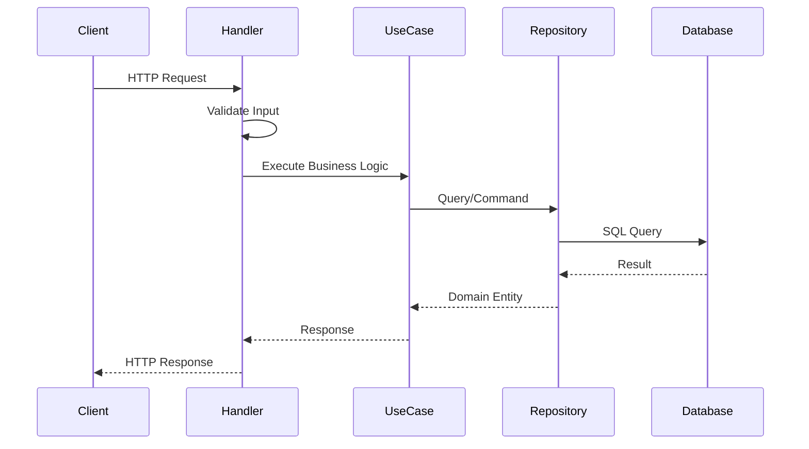
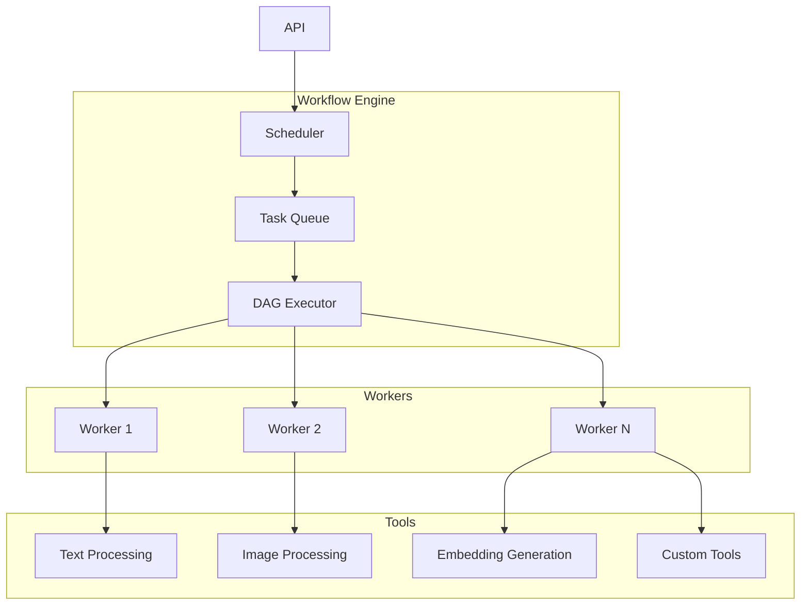
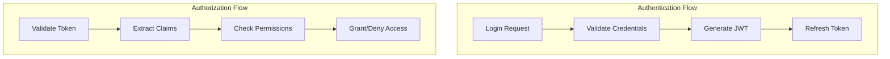
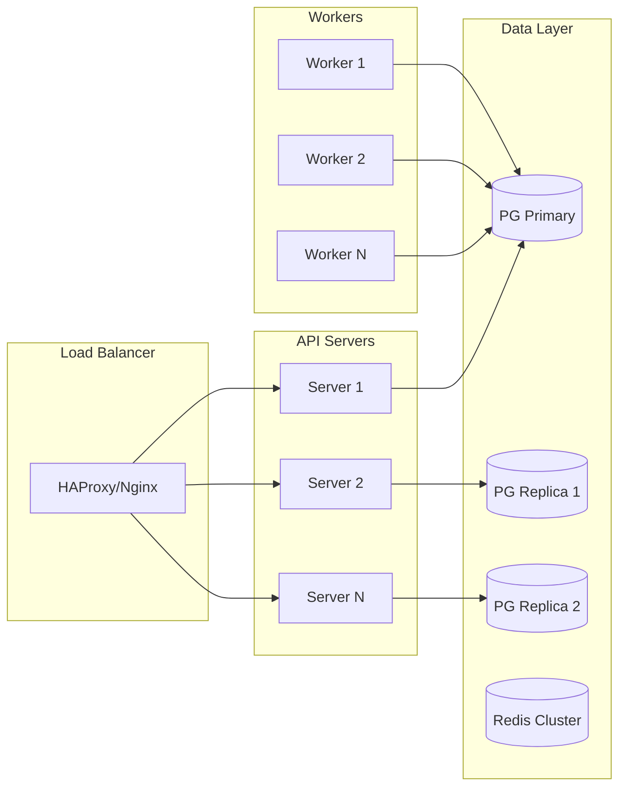
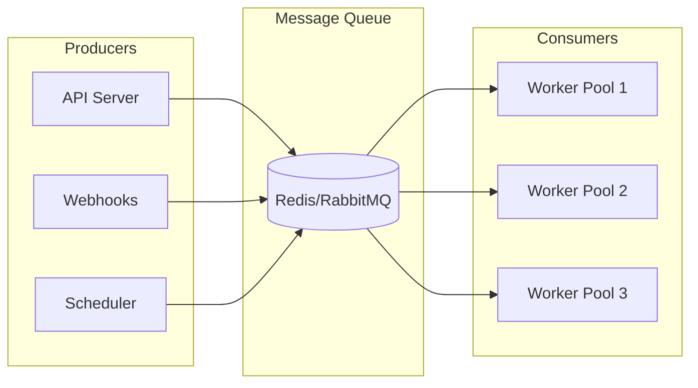
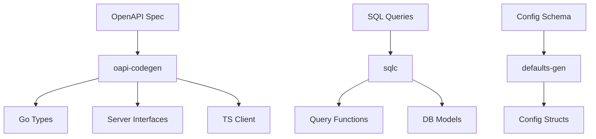
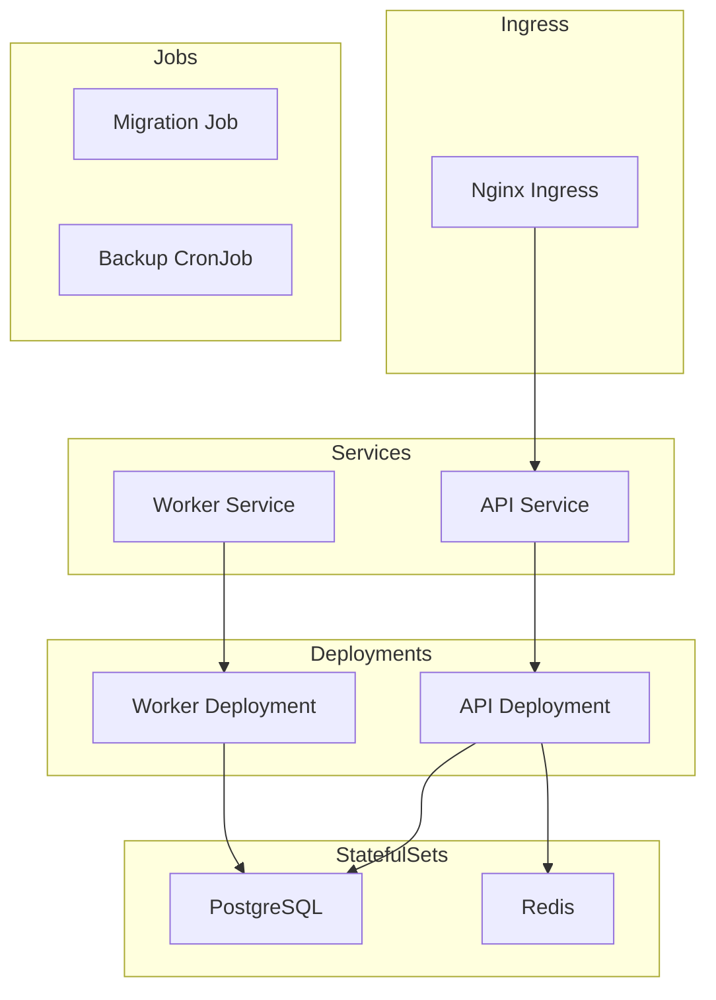
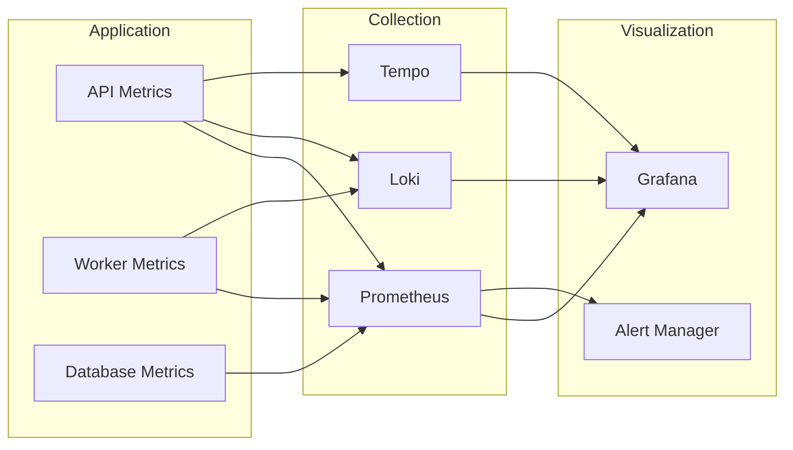

# Architecture Documentation

## Overview

ArchesAI follows a **Hexagonal Architecture** (Ports and Adapters) pattern combined with **Domain-Driven Design (DDD)** principles. This architecture ensures separation of concerns, testability, and maintainability while keeping the business logic independent of external dependencies.

## Core Architectural Principles

### 1. Hexagonal Architecture

The hexagonal architecture isolates the core business logic from external concerns:

```
┌─────────────────────────────────────────────────────────┐
│                    Presentation Layer                    │
│                  (HTTP Handlers, CLI)                    │
└────────────────────────┬───────────────────────────────┘
                         │
┌────────────────────────▼───────────────────────────────┐
│                    Application Layer                    │
│               (Use Cases, Orchestration)                │
└────────────────────────┬───────────────────────────────┘
                         │
┌────────────────────────▼───────────────────────────────┐
│                     Domain Layer                        │
│            (Entities, Business Rules, Ports)            │
└────────────────────────┬───────────────────────────────┘
                         │
┌────────────────────────▼───────────────────────────────┐
│                 Infrastructure Layer                    │
│        (Database, External APIs, File System)           │
└─────────────────────────────────────────────────────────┘
```

### 2. Domain-Driven Design

Each bounded context represents a distinct business domain:

- **Auth Domain**: User authentication and authorization
- **Organizations Domain**: Multi-tenant organization management
- **Workflows Domain**: DAG-based data processing pipelines
- **Content Domain**: Artifact and content management

### 3. Clean Architecture Principles

- **Dependency Rule**: Dependencies point inward toward the domain
- **Interface Segregation**: Small, focused interfaces
- **Dependency Inversion**: Depend on abstractions, not concretions
- **Single Responsibility**: Each component has one reason to change

## System Architecture

### High-Level Architecture



### Component Architecture



## Project Structure

### Directory Layout

```
archesai/
├── api/                          # API Specifications
│   ├── openapi.yaml             # Main OpenAPI spec
│   ├── paths/                   # Path definitions
│   │   ├── auth.yaml
│   │   ├── organizations.yaml
│   │   └── workflows.yaml
│   └── components/              # Reusable components
│       ├── schemas/
│       ├── parameters/
│       └── responses/
│
├── cmd/                         # Application Entry Points
│   ├── archesai/               # Main server
│   │   └── main.go
│   ├── worker/                 # Background worker
│   │   └── main.go
│   └── cli/                    # CLI tool
│       └── main.go
│
├── internal/                    # Private Application Code
│   ├── app/                    # Application Assembly
│   │   ├── deps.go            # Dependency injection
│   │   ├── routes.go          # Route registration
│   │   ├── middleware.go      # Global middleware
│   │   └── server.go          # Server configuration
│   │
│   ├── auth/                   # Auth Domain
│   │   ├── domain/            # Core business logic
│   │   │   ├── entities.go   # Domain entities
│   │   │   ├── ports.go      # Repository interfaces
│   │   │   ├── usecase.go    # Business use cases
│   │   │   └── types.gen.go  # Generated types
│   │   ├── adapters/          # Infrastructure adapters
│   │   │   ├── postgres/     # PostgreSQL implementation
│   │   │   └── adapters.gen.go
│   │   ├── handlers/          # HTTP handlers
│   │   │   └── http/
│   │   └── generated/         # Generated code
│   │
│   ├── organizations/          # Organizations Domain
│   ├── workflows/              # Workflows Domain
│   ├── content/                # Content Domain
│   │
│   ├── database/               # Database Layer
│   │   ├── postgresql/        # Generated SQLC code
│   │   ├── queries/           # SQL queries
│   │   └── migrations/        # Database migrations
│   │
│   ├── config/                 # Configuration
│   │   ├── config.go
│   │   └── defaults.gen.go
│   │
│   └── middleware/             # Shared Middleware
│       ├── auth.go
│       ├── cors.go
│       └── ratelimit.go
│
├── pkg/                        # Public Packages
│   ├── errors/                # Error handling
│   ├── logger/                # Logging utilities
│   └── validator/             # Validation helpers
│
├── web/                        # Frontend Applications
│   ├── platform/              # Main React app
│   ├── client/                # TypeScript API client
│   └── ui/                    # Shared UI components
│
└── deployments/                # Deployment Configurations
    ├── docker/                # Dockerfiles
    ├── kubernetes/            # K8s manifests
    └── terraform/             # Infrastructure as Code
```

## Domain Architecture

### Domain Structure

Each domain follows this structure:

```
domain/
├── domain/                     # Core Business Logic
│   ├── entities.go            # Domain entities
│   ├── ports.go              # Repository interfaces
│   ├── usecase.go            # Business use cases
│   ├── errors.go             # Domain-specific errors
│   └── types.gen.go          # Generated types from OpenAPI
│
├── adapters/                   # Adapters Layer
│   ├── postgres/              # Database implementation
│   │   └── repository.go     # Repository implementation
│   ├── http/                  # HTTP adapters
│   │   └── dto.go           # Data transfer objects
│   └── adapters.gen.go       # Generated type converters
│
├── handlers/                   # Presentation Layer
│   └── http/
│       ├── handler.go        # HTTP request handlers
│       └── routes.go         # Route definitions
│
└── generated/                  # Generated Code
    └── api/
        ├── server.gen.go     # Generated server interface
        └── types.gen.go      # Generated request/response types
```

### Domain Interactions



## Data Flow Architecture

### Request Processing Pipeline

1. **Client Request** → Load Balancer
2. **Load Balancer** → API Server
3. **API Server** → Router
4. **Router** → Middleware Chain
5. **Middleware** → Handler
6. **Handler** → Use Case
7. **Use Case** → Repository/Service
8. **Repository** → Database
9. **Response** flows back through the same layers

### Workflow Execution Architecture



## Database Architecture

### Schema Design

```sql
-- Core Tables
users
organizations
organization_members

-- Auth Tables
sessions
accounts
verification_tokens

-- Workflow Tables
workflows
workflow_runs
workflow_nodes
workflow_edges

-- Content Tables
artifacts
artifact_embeddings
labels
artifact_labels

-- Audit Tables
audit_logs
activity_logs
```

### Database Patterns

1. **UUID Primary Keys**: All tables use UUIDs for global uniqueness
2. **Soft Deletes**: Critical data uses soft deletes with `deleted_at`
3. **Audit Trails**: All changes logged to audit tables
4. **Multi-tenancy**: Row-level security with `organization_id`
5. **Vector Storage**: pgvector for embedding storage and similarity search

### Query Patterns

- **SQLC**: Type-safe SQL queries
- **Transactions**: ACID compliance for critical operations
- **Prepared Statements**: Protection against SQL injection
- **Connection Pooling**: Efficient resource usage

## Security Architecture

### Authentication & Authorization



### Security Layers

1. **Network Security**
   - TLS/SSL encryption
   - Rate limiting
   - DDoS protection
   - WAF rules

2. **Application Security**
   - JWT authentication
   - RBAC authorization
   - Input validation
   - Output encoding
   - CSRF protection

3. **Data Security**
   - Encryption at rest
   - Encryption in transit
   - Key management
   - Data masking
   - Audit logging

## Scalability Architecture

### Horizontal Scaling



### Caching Strategy

1. **Application Cache** (Redis)
   - Session data
   - Frequently accessed data
   - Rate limiting counters

2. **Database Cache**
   - Query result caching
   - Prepared statement caching

3. **CDN** (Static Assets)
   - Frontend assets
   - Public artifacts
   - API documentation

### Queue Architecture



## Development Architecture

### Code Generation Pipeline



### Testing Architecture

1. **Unit Tests**
   - Domain logic testing
   - Pure functions
   - Mocked dependencies

2. **Integration Tests**
   - API endpoint testing
   - Database operations
   - External service integration

3. **E2E Tests**
   - Complete user flows
   - Multi-service interactions
   - Performance testing

## Deployment Architecture

### Container Architecture

```yaml
services:
  api:
    image: archesai/api
    replicas: 3
    resources:
      limits:
        cpu: 1000m
        memory: 1Gi

  worker:
    image: archesai/worker
    replicas: 5
    resources:
      limits:
        cpu: 2000m
        memory: 2Gi

  postgres:
    image: postgres:15-pgvector
    replicas: 1
    storage: 100Gi

  redis:
    image: redis:7-alpine
    replicas: 3
    mode: cluster
```

### Kubernetes Architecture



## Monitoring & Observability

### Metrics Collection



### Key Metrics

1. **Application Metrics**
   - Request rate
   - Response time
   - Error rate
   - Throughput

2. **Infrastructure Metrics**
   - CPU usage
   - Memory usage
   - Disk I/O
   - Network traffic

3. **Business Metrics**
   - User registrations
   - Workflow executions
   - Artifact processing
   - API usage

## Performance Considerations

### Optimization Strategies

1. **Database Optimization**
   - Proper indexing
   - Query optimization
   - Connection pooling
   - Read replicas

2. **Caching**
   - Redis for hot data
   - HTTP caching headers
   - Query result caching

3. **Async Processing**
   - Background jobs
   - Message queues
   - Event-driven architecture

4. **Resource Management**
   - Connection pooling
   - Goroutine management
   - Memory profiling
   - CPU profiling

## Technology Stack

### Backend

- **Language**: Go 1.21+
- **Framework**: Echo v4
- **Database**: PostgreSQL 15+ with pgvector
- **Cache**: Redis 7+
- **Queue**: Redis/RabbitMQ
- **Authentication**: JWT

### Frontend

- **Framework**: React 18+
- **Language**: TypeScript 5+
- **Routing**: TanStack Router
- **State**: Zustand/TanStack Query
- **Build**: Vite
- **UI**: Tailwind CSS

### Infrastructure

- **Container**: Docker
- **Orchestration**: Kubernetes
- **CI/CD**: GitHub Actions
- **Monitoring**: Prometheus/Grafana
- **Logging**: Loki
- **Tracing**: Tempo/Jaeger

### Code Generation

- **API**: OpenAPI 3.0 + oapi-codegen
- **Database**: SQLC
- **Configuration**: Custom generators

## Best Practices

### Architectural Principles

1. **SOLID Principles**
   - Single Responsibility
   - Open/Closed
   - Liskov Substitution
   - Interface Segregation
   - Dependency Inversion

2. **DRY** (Don't Repeat Yourself)
   - Code generation for repetitive tasks
   - Shared libraries for common functionality

3. **KISS** (Keep It Simple, Stupid)
   - Simple solutions over complex ones
   - Clear and readable code

4. **YAGNI** (You Aren't Gonna Need It)
   - Build only what's needed
   - Avoid premature optimization

### Code Organization

1. **Domain Isolation**
   - Each domain is self-contained
   - Clear boundaries between domains
   - Minimal cross-domain dependencies

2. **Layered Architecture**
   - Clear separation of concerns
   - Dependencies flow inward
   - Business logic in the core

3. **Interface-Based Design**
   - Program to interfaces
   - Dependency injection
   - Easy testing and mocking

## Future Architecture Considerations

### Planned Enhancements

1. **Microservices Migration**
   - Service mesh (Istio)
   - gRPC communication
   - Independent deployments

2. **Event Sourcing**
   - Event store
   - CQRS pattern
   - Event replay capability

3. **GraphQL API**
   - Federation
   - Subscriptions
   - Schema stitching

4. **Multi-Region Deployment**
   - Global load balancing
   - Data replication
   - Edge computing

## References

- [The Clean Architecture](https://blog.cleancoder.com/uncle-bob/2012/08/13/the-clean-architecture.html)
- [Hexagonal Architecture](https://alistair.cockburn.us/hexagonal-architecture/)
- [Domain-Driven Design](https://martinfowler.com/books/ddd.html)
- [Twelve-Factor App](https://12factor.net/)
- [Go Project Layout](https://github.com/golang-standards/project-layout)
