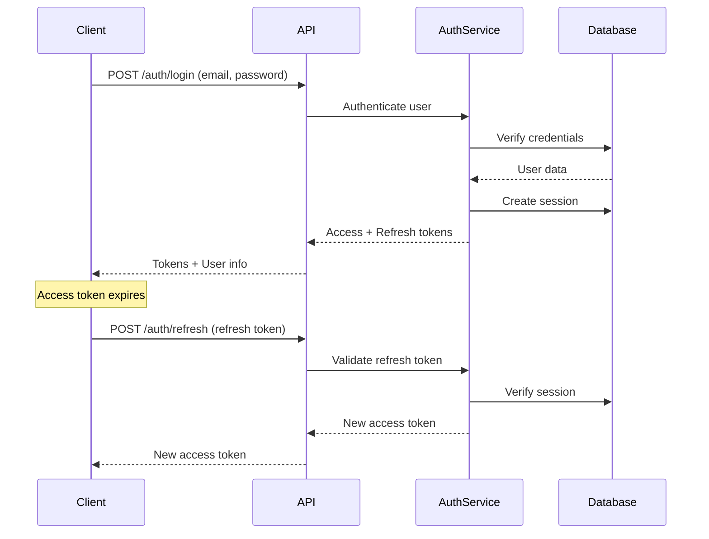

# Authentication System Documentation

This document describes the authentication and authorization system implemented in ArchesAI.

## Overview

ArchesAI uses a JWT-based authentication system with refresh tokens for secure, stateless
authentication. The system supports:

- User registration and login
- Access and refresh tokens
- Session management
- Password hashing with bcrypt
- Multi-organization support
- Token rotation for enhanced security

## Architecture

### Components

1. **Auth Domain** (`internal/auth/`)
   - Core business logic for authentication
   - User and session entities
   - Repository interfaces (ports)
   - Use cases for auth operations

2. **Auth Handlers** (`internal/auth/handlers/http/`)
   - HTTP endpoints for auth operations
   - Request/response handling
   - Input validation

3. **Auth Repository** (`internal/auth/adapters/postgres/`)
   - PostgreSQL implementation of auth repository
   - User and session persistence
   - Database queries via SQLC

4. **Auth Middleware** (`internal/middleware/`)
   - JWT validation
   - Request authentication
   - Context enrichment with user claims

## Token System

### Token Types

#### Access Token

- **Purpose**: Authenticate API requests
- **Lifetime**: 15 minutes (configurable)
- **Storage**: Client memory or secure storage
- **Claims**: User ID, email, issued at, expiration

#### Refresh Token

- **Purpose**: Obtain new access tokens
- **Lifetime**: 7 days (configurable)
- **Storage**: Secure client storage (HttpOnly cookie recommended)
- **Claims**: User ID, session ID, issued at, expiration

### Token Flow



## Database Schema

### Users Table

```sql
CREATE TABLE users (
  id UUID PRIMARY KEY DEFAULT gen_random_uuid(),
  email VARCHAR(255) UNIQUE NOT NULL,
  name VARCHAR(255),
  email_verified BOOLEAN DEFAULT false,
  image TEXT,
  created_at TIMESTAMPTZ DEFAULT CURRENT_TIMESTAMP,
  updated_at TIMESTAMPTZ DEFAULT CURRENT_TIMESTAMP
);
```

### Sessions Table

```sql
CREATE TABLE sessions (
  id UUID PRIMARY KEY DEFAULT gen_random_uuid(),
  user_id UUID NOT NULL REFERENCES users (id) ON DELETE CASCADE,
  token TEXT UNIQUE NOT NULL,
  expires_at TIMESTAMPTZ NOT NULL,
  active_organization_id UUID,
  ip_address VARCHAR(45),
  user_agent TEXT,
  created_at TIMESTAMPTZ DEFAULT CURRENT_TIMESTAMP,
  updated_at TIMESTAMPTZ DEFAULT CURRENT_TIMESTAMP
);
```

### Accounts Table (for OAuth providers)

```sql
CREATE TABLE accounts (
  id UUID PRIMARY KEY DEFAULT gen_random_uuid(),
  user_id UUID NOT NULL REFERENCES users (id) ON DELETE CASCADE,
  provider VARCHAR(50) NOT NULL,
  provider_account_id VARCHAR(255) NOT NULL,
  refresh_token TEXT,
  access_token TEXT,
  expires_at TIMESTAMPTZ,
  token_type VARCHAR(50),
  scope TEXT,
  id_token TEXT,
  session_state TEXT,
  created_at TIMESTAMPTZ DEFAULT CURRENT_TIMESTAMP,
  updated_at TIMESTAMPTZ DEFAULT CURRENT_TIMESTAMP,
  UNIQUE (provider, provider_account_id)
);
```

## API Endpoints

### Public Endpoints

#### Register

```http
POST /api/auth/register
Content-Type: application/json

{
  "email": "user@example.com",
  "password": "SecurePass123!",
  "name": "John Doe"
}
```

Response:

```json
{
  "user": {
    "id": "uuid",
    "email": "user@example.com",
    "name": "John Doe"
  },
  "tokens": {
    "accessToken": "eyJhbGc...",
    "refreshToken": "eyJhbGc...",
    "expiresIn": 900
  }
}
```

#### Login

```http
POST /api/auth/login
Content-Type: application/json

{
  "email": "user@example.com",
  "password": "SecurePass123!"
}
```

#### Refresh Token

```http
POST /api/auth/refresh
Content-Type: application/json

{
  "refreshToken": "eyJhbGc..."
}
```

### Protected Endpoints

#### Get Current User

```http
GET /api/auth/me
Authorization: Bearer <access_token>
```

#### Logout

```http
POST /api/auth/logout
Authorization: Bearer <access_token>
```

#### Update Profile

```http
PUT /api/auth/profile
Authorization: Bearer <access_token>
Content-Type: application/json

{
  "name": "Jane Doe",
  "image": "https://example.com/avatar.jpg"
}
```

## Implementation Details

### Password Hashing

Passwords are hashed using bcrypt with a cost factor of 10:

```go
func hashPassword(password string) (string, error) {
    bytes, err := bcrypt.GenerateFromPassword([]byte(password), 10)
    return string(bytes), err
}

func verifyPassword(password, hash string) bool {
    err := bcrypt.CompareHashAndPassword([]byte(hash), []byte(password))
    return err == nil
}
```

### JWT Generation

```go
func generateAccessToken(userID uuid.UUID, email string) (string, error) {
    claims := &Claims{
        UserID: userID,
        Email:  email,
        RegisteredClaims: jwt.RegisteredClaims{
            ExpiresAt: jwt.NewNumericDate(time.Now().Add(15 * time.Minute)),
            IssuedAt:  jwt.NewNumericDate(time.Now()),
            Issuer:    "archesai",
        },
    }

    token := jwt.NewWithClaims(jwt.SigningMethodHS256, claims)
    return token.SignedString([]byte(jwtSecret))
}
```

### Middleware Implementation

```go
func RequireAuth() echo.MiddlewareFunc {
    return func(next echo.HandlerFunc) echo.HandlerFunc {
        return func(c echo.Context) error {
            // Extract token from Authorization header
            auth := c.Request().Header.Get("Authorization")
            if auth == "" {
                return echo.NewHTTPError(http.StatusUnauthorized, "missing authorization")
            }

            // Validate Bearer token format
            parts := strings.Split(auth, " ")
            if len(parts) != 2 || parts[0] != "Bearer" {
                return echo.NewHTTPError(http.StatusUnauthorized, "invalid authorization format")
            }

            // Parse and validate JWT
            token, err := jwt.ParseWithClaims(parts[1], &Claims{}, func(token *jwt.Token) (interface{}, error) {
                return []byte(jwtSecret), nil
            })

            if err != nil || !token.Valid {
                return echo.NewHTTPError(http.StatusUnauthorized, "invalid token")
            }

            // Add claims to context
            claims := token.Claims.(*Claims)
            c.Set("user_id", claims.UserID)
            c.Set("user_email", claims.Email)

            return next(c)
        }
    }
}
```

## Security Considerations

### Token Security

1. **Secure Storage**:
   - Store access tokens in memory or secure client storage
   - Use HttpOnly, Secure, SameSite cookies for refresh tokens in web apps
   - Never store tokens in localStorage for sensitive applications

2. **Token Rotation**:
   - Rotate refresh tokens on use
   - Implement token blacklisting for logout
   - Monitor for token reuse attacks

3. **HTTPS Only**:
   - Always use HTTPS in production
   - Set Secure flag on cookies
   - Implement HSTS headers

### Password Security

1. **Requirements**:
   - Minimum 8 characters
   - Mix of uppercase, lowercase, numbers, and symbols
   - Check against common password lists

2. **Storage**:
   - Never store plaintext passwords
   - Use bcrypt with cost factor ≥ 10
   - Salt passwords automatically (bcrypt handles this)

3. **Reset Flow**:
   - Secure random reset tokens
   - Time-limited validity (1 hour)
   - Single use tokens
   - Email verification required

### Session Security

1. **Session Management**:
   - Database-backed sessions
   - Session expiration
   - Device tracking (IP, User-Agent)
   - Concurrent session limits (optional)

2. **Invalidation**:
   - Logout invalidates session
   - Password change invalidates all sessions
   - Admin can revoke user sessions

## Multi-Organization Support

### Organization Context

Users can belong to multiple organizations. The active organization is tracked in the session:

```go
type Session struct {
    ID                   uuid.UUID
    UserID              uuid.UUID
    ActiveOrganizationID *uuid.UUID
    // ... other fields
}
```

### Switching Organizations

```http
POST /api/auth/switch-organization
Authorization: Bearer <access_token>
Content-Type: application/json

{
  "organizationId": "org-uuid"
}
```

### Organization-Scoped Requests

The active organization is included in the JWT claims and available in request context:

```go
func (h *Handler) GetWorkflows(c echo.Context) error {
    orgID := c.Get("organization_id").(uuid.UUID)
    // Query workflows for this organization
}
```

## Error Handling

### Standard Error Responses

```json
{
  "error": {
    "code": "INVALID_CREDENTIALS",
    "message": "Invalid email or password"
  }
}
```

### Error Codes

- `INVALID_CREDENTIALS`: Wrong email/password
- `USER_EXISTS`: Email already registered
- `INVALID_TOKEN`: Token validation failed
- `TOKEN_EXPIRED`: Token has expired
- `SESSION_EXPIRED`: Session has expired
- `UNAUTHORIZED`: Missing or invalid authentication
- `FORBIDDEN`: Insufficient permissions

## Configuration

### Environment Variables

```bash
# JWT Configuration
ARCHESAI_JWT_SECRET=your-secret-key-min-32-chars
ARCHESAI_JWT_ACCESS_TOKEN_DURATION=15m
ARCHESAI_JWT_REFRESH_TOKEN_DURATION=7d

# Password Policy
ARCHESAI_AUTH_PASSWORD_MIN_LENGTH=8
ARCHESAI_AUTH_PASSWORD_REQUIRE_UPPERCASE=true
ARCHESAI_AUTH_PASSWORD_REQUIRE_NUMBERS=true
ARCHESAI_AUTH_PASSWORD_REQUIRE_SYMBOLS=true

# Session Configuration
ARCHESAI_AUTH_MAX_SESSIONS_PER_USER=5
ARCHESAI_AUTH_SESSION_IDLE_TIMEOUT=30m
```

## Testing

### Unit Tests

Test auth service logic:

```go
func TestAuthService_Login(t *testing.T) {
    tests := []struct {
        name    string
        email   string
        password string
        wantErr bool
    }{
        {
            name:     "valid credentials",
            email:    "test@example.com",
            password: "correct_password",
            wantErr:  false,
        },
        {
            name:     "invalid password",
            email:    "test@example.com",
            password: "wrong_password",
            wantErr:  true,
        },
    }
    // ... test implementation
}
```

### Integration Tests

Test complete auth flow:

```go
func TestAuthFlow(t *testing.T) {
    // 1. Register user
    // 2. Login
    // 3. Use access token
    // 4. Refresh token
    // 5. Logout
}
```

## Migration Guide

### From Session-Based Auth

1. Generate JWT secret
2. Configure token durations
3. Update client to handle tokens
4. Implement token refresh logic
5. Remove session cookies

### Adding OAuth Providers

1. Configure provider credentials
2. Implement OAuth callback handler
3. Link OAuth accounts to users
4. Handle account merging

## Troubleshooting

### Common Issues

1. **"Invalid token" errors**:
   - Check JWT secret configuration
   - Verify token hasn't expired
   - Ensure proper Bearer token format

2. **"User not found" after registration**:
   - Check database migrations
   - Verify email uniqueness
   - Check for transaction rollbacks

3. **Session expired immediately**:
   - Verify time configuration
   - Check server time sync
   - Review token duration settings

## Future Enhancements

### Planned Features

1. **OAuth Integration**:
   - Google OAuth
   - GitHub OAuth
   - SAML support

2. **Enhanced Security**:
   - Two-factor authentication (2FA)
   - Biometric authentication
   - Risk-based authentication

3. **Advanced Session Management**:
   - Device management
   - Session activity logs
   - Geo-location tracking

4. **Role-Based Access Control**:
   - Fine-grained permissions
   - Custom roles
   - Resource-level permissions

## References

- [JWT RFC 7519](https://tools.ietf.org/html/rfc7519)
- [OAuth 2.0 RFC 6749](https://tools.ietf.org/html/rfc6749)
- [OWASP Authentication Cheat Sheet](https://cheatsheetseries.owasp.org/cheatsheets/Authentication_Cheat_Sheet.html)
- [bcrypt](https://en.wikipedia.org/wiki/Bcrypt)
