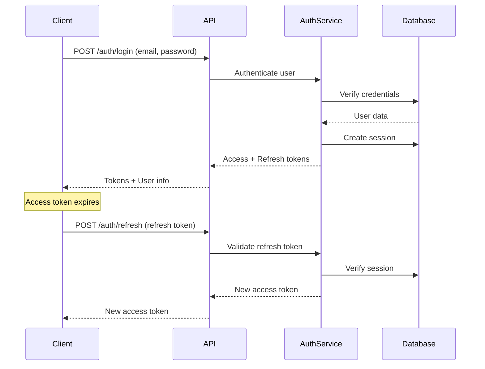

# Authentication System Documentation

This document describes the authentication and authorization system implemented in Arches.

## Overview

Arches provides a comprehensive authentication system with multiple authentication methods and security features:

- **JWT-based authentication** with access and refresh tokens
- **Email/password authentication** with registration and login
- **OAuth integration** for third-party providers
- **Magic link authentication** for passwordless login
- **Session management** with multi-device support
- **Email verification** and password reset flows
- **Account linking** for multiple auth methods

## API Endpoints

### Core Authentication

| Endpoint              | Method | Description                           |
| --------------------- | ------ | ------------------------------------- |
| `/auth/register`      | POST   | Register new user with email/password |
| `/auth/login`         | POST   | Login with email/password             |
| `/auth/logout`        | POST   | Logout current session                |
| `/auth/logout-all`    | POST   | Logout all sessions                   |
| `/auth/sessions`      | GET    | List all active sessions              |
| `/auth/sessions/{id}` | DELETE | Terminate specific session            |

### Email Management

| Endpoint                     | Method | Description                    |
| ---------------------------- | ------ | ------------------------------ |
| `/auth/verify-email`         | POST   | Verify email with token        |
| `/auth/request-verification` | POST   | Request new verification email |
| `/auth/confirm-email`        | POST   | Confirm email change           |
| `/auth/change-email`         | POST   | Request email change           |

### Password Management

| Endpoint                | Method | Description               |
| ----------------------- | ------ | ------------------------- |
| `/auth/forgot-password` | POST   | Request password reset    |
| `/auth/reset-password`  | POST   | Reset password with token |

### Magic Links (Passwordless)

| Endpoint                    | Method | Description              |
| --------------------------- | ------ | ------------------------ |
| `/auth/magic-links/request` | POST   | Request magic link email |
| `/auth/magic-links/verify`  | POST   | Verify magic link token  |

### OAuth & Account Linking

| Endpoint                           | Method | Description                 |
| ---------------------------------- | ------ | --------------------------- |
| `/auth/oauth/{provider}/authorize` | GET    | Initiate OAuth flow         |
| `/auth/oauth/{provider}/callback`  | GET    | Handle OAuth callback       |
| `/auth/accounts`                   | GET    | List linked accounts        |
| `/auth/accounts/{id}`              | DELETE | Unlink account              |
| `/auth/link`                       | POST   | Link additional auth method |

## Token System

### Token Types

#### Access Token

- **Purpose**: Authenticate API requests
- **Lifetime**: 15 minutes (configurable)
- **Storage**: Client memory or secure storage
- **Claims**: User ID, email, issued at, expiration

#### Refresh Token

- **Purpose**: Obtain new access tokens
- **Lifetime**: 7 days (configurable)
- **Storage**: Secure client storage (HttpOnly cookie recommended)
- **Claims**: User ID, session ID, issued at, expiration

### Token Flow



## Authentication Methods

### 1. Email/Password

Traditional authentication with email and password:

```json
POST /auth/register
{
  "email": "user@example.com",
  "name": "John Doe",
  "password": "secure-password-123"
}

POST /auth/login
{
  "email": "user@example.com",
  "password": "secure-password-123"
}
```

### 2. Magic Links

Passwordless authentication via email:

```json
POST /auth/magic-links/request
{
  "email": "user@example.com"
}

POST /auth/magic-links/verify
{
  "token": "magic-link-token-from-email"
}
```

### 3. OAuth Providers

Third-party authentication (Google, GitHub, etc.):

```bash
# Redirect user to:
GET /auth/oauth/google/authorize

# Callback handled at:
GET /auth/oauth/google/callback?code=...&state=...
```

## Database Schema

### Users Table

```sql
CREATE TABLE users (
  id UUID PRIMARY KEY DEFAULT gen_random_uuid(),
  email VARCHAR(255) UNIQUE NOT NULL,
  name VARCHAR(255),
  email_verified BOOLEAN DEFAULT false,
  image TEXT,
  created_at TIMESTAMPTZ DEFAULT CURRENT_TIMESTAMP,
  updated_at TIMESTAMPTZ DEFAULT CURRENT_TIMESTAMP
);
```

### Sessions Table

```sql
CREATE TABLE sessions (
  id UUID PRIMARY KEY DEFAULT gen_random_uuid(),
  user_id UUID NOT NULL REFERENCES users(id) ON DELETE CASCADE,
  token_hash VARCHAR(255) UNIQUE NOT NULL,
  expires_at TIMESTAMPTZ NOT NULL,
  ip_address INET,
  user_agent TEXT,
  created_at TIMESTAMPTZ DEFAULT CURRENT_TIMESTAMP,
  updated_at TIMESTAMPTZ DEFAULT CURRENT_TIMESTAMP
);
```

### Accounts Table (OAuth)

```sql
CREATE TABLE accounts (
  id UUID PRIMARY KEY DEFAULT gen_random_uuid(),
  user_id UUID NOT NULL REFERENCES users(id) ON DELETE CASCADE,
  provider VARCHAR(50) NOT NULL,
  provider_account_id VARCHAR(255) NOT NULL,
  access_token TEXT,
  refresh_token TEXT,
  expires_at TIMESTAMPTZ,
  created_at TIMESTAMPTZ DEFAULT CURRENT_TIMESTAMP,
  updated_at TIMESTAMPTZ DEFAULT CURRENT_TIMESTAMP,
  UNIQUE(provider, provider_account_id)
);
```

## Security Features

### Password Security

- **Hashing**: bcrypt with configurable cost factor (default: 10)
- **Minimum Length**: 8 characters
- **Maximum Length**: 72 characters (bcrypt limitation)

### Session Management

- **Multi-device Support**: Track sessions across devices
- **Session Invalidation**: Logout single or all sessions
- **IP Tracking**: Monitor session locations
- **User Agent Tracking**: Identify devices

### Token Security

- **JWT Signing**: HMAC-SHA256 or RS256
- **Token Rotation**: Refresh tokens rotate on use
- **Expiration**: Configurable lifetimes
- **Revocation**: Sessions can be terminated

### Rate Limiting

- Login attempts: 5 per minute
- Registration: 3 per hour
- Password reset: 3 per hour
- Magic links: 5 per hour

## Configuration

Authentication settings in `.archesai.yaml`:

```yaml
auth:
  enabled: true
  jwt_secret: ${JWT_SECRET} # Use environment variable
  access_token_expiry: 15m
  refresh_token_expiry: 7d

  password:
    min_length: 8
    max_length: 72
    bcrypt_cost: 10

  email:
    verification_required: true
    verification_expiry: 24h

  magic_links:
    enabled: true
    expiry: 15m

  oauth:
    google:
      enabled: true
      client_id: ${GOOGLE_CLIENT_ID}
      client_secret: ${GOOGLE_CLIENT_SECRET}
    github:
      enabled: true
      client_id: ${GITHUB_CLIENT_ID}
      client_secret: ${GITHUB_CLIENT_SECRET}

  rate_limits:
    login: 5/min
    register: 3/hour
    password_reset: 3/hour
```

## Implementation

### Middleware

Authentication middleware validates JWT tokens and enriches request context:

```go
// middleware/auth.go
func AuthMiddleware(next echo.HandlerFunc) echo.HandlerFunc {
    return func(c echo.Context) error {
        token := extractToken(c)
        if token == "" {
            return echo.NewHTTPError(401, "missing token")
        }

        claims, err := validateToken(token)
        if err != nil {
            return echo.NewHTTPError(401, "invalid token")
        }

        c.Set("user_id", claims.UserID)
        c.Set("user_email", claims.Email)

        return next(c)
    }
}
```

### Protected Routes

Apply middleware to protect endpoints:

```go
// Protected routes
api := e.Group("/api/v1")
api.Use(AuthMiddleware)

// Public auth routes
auth := e.Group("/auth")
auth.POST("/register", h.Register)
auth.POST("/login", h.Login)
// ... other public auth endpoints
```

## Best Practices

1. **Always use HTTPS** in production
2. **Store tokens securely** (HttpOnly cookies for web)
3. **Implement CSRF protection** for state-changing operations
4. **Use secure headers** (HSTS, CSP, etc.)
5. **Monitor failed login attempts** for security
6. **Implement account lockout** after repeated failures
7. **Log security events** for audit trails
8. **Rotate secrets regularly** in production
9. **Use environment variables** for sensitive config
10. **Implement proper CORS** policies

## Testing

Test authentication flows:

```bash
# Register
curl -X POST http://localhost:3001/auth/register \
  -H "Content-Type: application/json" \
  -d '{"email":"test@example.com","name":"Test User","password":"Test123!"}'

# Login
curl -X POST http://localhost:3001/auth/login \
  -H "Content-Type: application/json" \
  -d '{"email":"test@example.com","password":"Test123!"}'

# Use token
curl -H "Authorization: Bearer {access_token}" \
  http://localhost:3001/api/v1/users/me
```

## Troubleshooting

### Common Issues

1. **"Invalid token" errors**
   - Check token expiration
   - Verify JWT secret matches
   - Ensure proper token format

2. **"Account already exists"**
   - Email already registered
   - Check for case sensitivity

3. **OAuth redirect errors**
   - Verify callback URLs in provider config
   - Check client ID/secret

4. **Session expired**
   - Normal behavior after token expiry
   - Implement token refresh logic

## See Also

- [API Reference](../api-reference/auth.md) - Complete auth API documentation
- [Security Guide](../security/overview.md) - Security best practices
- [Configuration](../guides/configuration.md) - Auth configuration options
