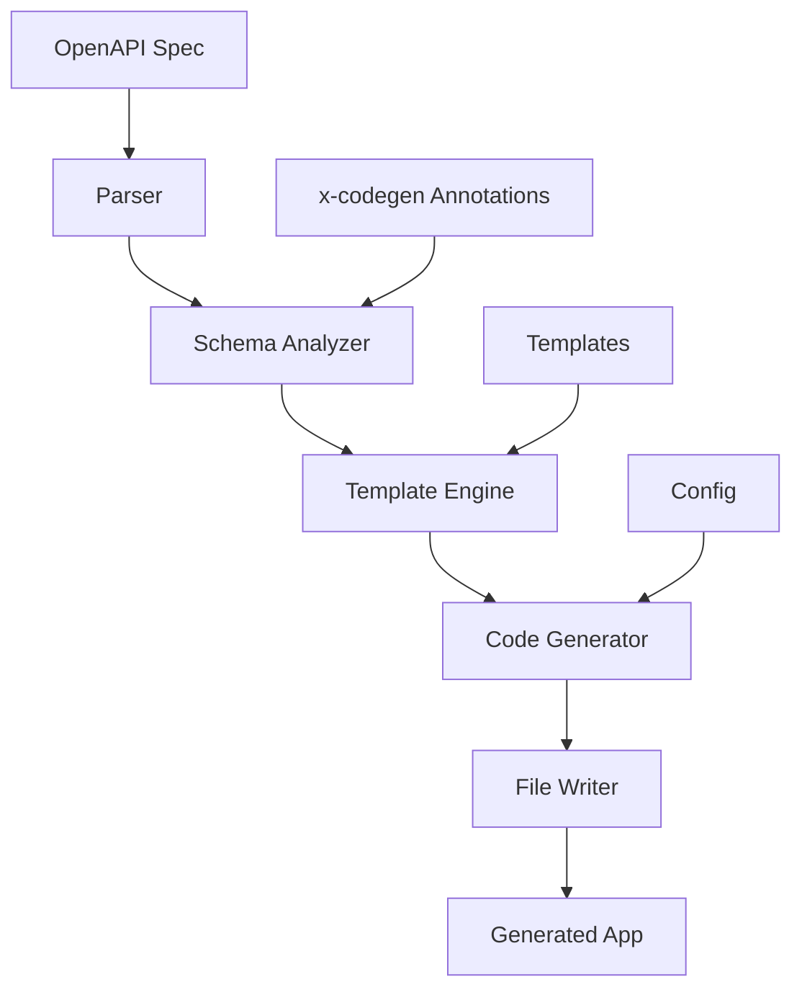

# Code Generation Architecture

This document explains how Arches transforms OpenAPI specifications into complete, production-ready applications.

## Overview

Arches uses a sophisticated template-based code generation system that:

1. Parses OpenAPI specifications
2. Enriches them with x-codegen annotations
3. Generates multiple layers of application code
4. Produces deployment configurations
5. Creates client SDKs

## Generation Pipeline



## Core Components

### 1. OpenAPI Parser

The parser (`internal/parsers/openapi.go`) reads and validates OpenAPI specifications:

- **Multi-file Support**: Handles $ref across multiple files
- **Version Support**: OpenAPI 3.0 and 3.1
- **Validation**: Ensures spec correctness
- **Bundling**: Can combine multi-file specs into one

### 2. Schema Analyzer

Analyzes the parsed specification to determine:

- **Models**: Extract data structures from schemas
- **Operations**: Identify all API endpoints
- **Relationships**: Detect entity relationships
- **Security**: Parse authentication requirements
- **Validation Rules**: Extract constraints

### 3. Template Engine

Arches uses Go's `text/template` with custom functions:

- **Template Location**: `internal/codegen/tmpl/`
- **Custom Functions**: String manipulation, case conversion
- **Conditional Logic**: Generate based on spec features
- **Iteration**: Loop over schemas, paths, operations

### 4. Code Generators

Different generators for each component:

#### Model Generator

```go
// Generates from OpenAPI schemas
type User struct {
    ID        uuid.UUID `json:"id" gorm:"primaryKey"`
    Email     string    `json:"email" gorm:"unique;not null"`
    Name      string    `json:"name"`
    CreatedAt time.Time `json:"createdAt"`
}
```

#### Controller Generator

```go
// Generates HTTP handlers
func (c *UserController) GetUser(ctx echo.Context) error {
    id := ctx.Param("id")
    user, err := c.service.GetUser(ctx.Request().Context(), id)
    if err != nil {
        return ctx.JSON(404, map[string]string{"error": "not found"})
    }
    return ctx.JSON(200, user)
}
```

#### Repository Generator

```go
// Generates database access
func (r *UserRepository) GetByID(id string) (*User, error) {
    var user User
    err := r.db.Where("id = ?", id).First(&user).Error
    return &user, err
}
```

## x-codegen Annotations

Custom OpenAPI extensions control generation:

### Available Annotations

| Annotation                 | Purpose                         | Example                            |
| -------------------------- | ------------------------------- | ---------------------------------- |
| `x-codegen-custom-handler` | Skip auto-generation of handler | `x-codegen-custom-handler: true`   |
| `x-public-endpoint`        | Skip authentication             | `x-public-endpoint: true`          |
| `x-codegen-ignore`         | Skip this path/schema           | `x-codegen-ignore: true`           |
| `x-codegen-repository`     | Custom repository name          | `x-codegen-repository: CustomRepo` |
| `x-codegen-service`        | Custom service name             | `x-codegen-service: CustomService` |
| `x-codegen-table`          | Custom database table           | `x-codegen-table: custom_users`    |

### Usage Example

```yaml
paths:
  /users:
    get:
      operationId: listUsers
      x-public-endpoint: true # No auth required
      x-codegen-custom-handler: true # Write handler manually
      responses:
        "200":
          description: User list

components:
  schemas:
    User:
      x-codegen-table: app_users # Custom table name
      type: object
      properties:
        id:
          type: string
          format: uuid
```

## Generated File Structure

### Backend (Go)

```plaintext
generated/
├── models/
│   ├── user.gen.go          # Data models
│   ├── base.gen.go          # Common models
│   └── errors.gen.go        # Error types
├── controllers/
│   ├── user_controller.gen.go
│   └── base_controller.gen.go
├── handlers/
│   ├── user_handler.gen.go  # Business logic
│   └── user_custom.go       # Custom logic (not overwritten)
├── repositories/
│   ├── user_repository.gen.go
│   └── interfaces.gen.go
├── services/
│   ├── user_service.gen.go
│   └── interfaces.gen.go
├── database/
│   ├── migrations/
│   │   └── 001_initial.sql
│   └── connection.gen.go
├── middleware/
│   ├── auth.gen.go
│   ├── cors.gen.go
│   └── logger.gen.go
├── bootstrap/
│   └── app.gen.go           # Application setup
└── main.go                  # Entry point
```

### Frontend (TypeScript/JavaScript)

```plaintext
client/
├── src/
│   ├── models/
│   │   ├── User.ts          # TypeScript interfaces
│   │   └── index.ts
│   ├── api/
│   │   ├── UserApi.ts       # API methods
│   │   └── BaseApi.ts
│   ├── client.ts            # Main client class
│   └── index.ts
├── package.json
└── tsconfig.json
```

### Infrastructure

```plaintext
deployments/
├── docker/
│   ├── Dockerfile           # Multi-stage build
│   └── docker-compose.yml   # Local development
├── kubernetes/
│   ├── deployment.yaml      # K8s deployment
│   ├── service.yaml         # K8s service
│   └── ingress.yaml         # K8s ingress
└── helm/
    └── chart/               # Helm chart
```

## Template System

### Template Files

Located in `internal/codegen/tmpl/`:

```plaintext
tmpl/
├── go/
│   ├── model.tmpl           # Model template
│   ├── controller.tmpl      # Controller template
│   ├── handler.tmpl         # Handler template
│   ├── repository.tmpl      # Repository template
│   └── service.tmpl         # Service template
├── typescript/
│   ├── model.tmpl           # TS interface template
│   ├── api.tmpl             # API client template
│   └── client.tmpl          # Main client template
├── sql/
│   ├── migration.tmpl       # Migration template
│   └── schema.tmpl          # Schema template
└── docker/
    ├── dockerfile.tmpl      # Dockerfile template
    └── compose.tmpl         # Docker Compose template
```

### Template Functions

Custom functions available in templates:

| Function       | Purpose               | Example                       |
| -------------- | --------------------- | ----------------------------- |
| `toPascalCase` | Convert to PascalCase | `{{ .Name \| toPascalCase }}` |
| `toCamelCase`  | Convert to camelCase  | `{{ .Name \| toCamelCase }}`  |
| `toSnakeCase`  | Convert to snake_case | `{{ .Name \| toSnakeCase }}`  |
| `toKebabCase`  | Convert to kebab-case | `{{ .Name \| toKebabCase }}`  |
| `toUpper`      | Convert to UPPERCASE  | `{{ .Name \| toUpper }}`      |
| `toLower`      | Convert to lowercase  | `{{ .Name \| toLower }}`      |
| `pluralize`    | Pluralize word        | `{{ .Name \| pluralize }}`    |
| `singularize`  | Singularize word      | `{{ .Name \| singularize }}`  |

### Template Example

```go
// model.tmpl
package models

{{range .Schemas}}
type {{.Name | toPascalCase}} struct {
    {{range .Properties}}
    {{.Name | toPascalCase}} {{.GoType}} `json:"{{.Name}}" gorm:"{{.GormTags}}"`
    {{end}}
}

func ({{.Name | toPascalCase}}) TableName() string {
    return "{{.TableName | toSnakeCase}}"
}
{{end}}
```

## Generation Process

### 1. Parse Phase

```go
// Parse OpenAPI specification
spec, err := parser.ParseOpenAPI("api.yaml")
if err != nil {
    return fmt.Errorf("parse error: %w", err)
}
```

### 2. Analyze Phase

```go
// Analyze specification
analysis := analyzer.Analyze(spec)
// Extract:
// - Models from components.schemas
// - Operations from paths
// - Security from components.securitySchemes
```

### 3. Generate Phase

```go
// Generate each component
for _, generator := range generators {
    files, err := generator.Generate(analysis)
    if err != nil {
        return fmt.Errorf("generation error: %w", err)
    }
    // Write files to disk
    for _, file := range files {
        writeFile(file.Path, file.Content)
    }
}
```

### 4. Post-Process Phase

```go
// Format generated code
exec.Command("go", "fmt", "./...").Run()
exec.Command("goimports", "-w", ".").Run()

// Run linters
exec.Command("golangci-lint", "run").Run()
```

## Customization

### Override Templates

Create custom templates in your project:

```plaintext
.arches/templates/
├── go/
│   └── model.tmpl  # Override default model template
└── config.yaml     # Template configuration
```

### Custom Generators

Implement the Generator interface:

```go
type Generator interface {
    Name() string
    Generate(spec *OpenAPISpec) ([]File, error)
}

type CustomGenerator struct{}

func (g *CustomGenerator) Generate(spec *OpenAPISpec) ([]File, error) {
    // Custom generation logic
    return files, nil
}
```

### Generation Hooks

Add pre/post generation hooks:

```yaml
# .arches.yaml
generation:
  pre_hooks:
    - cmd: "echo Starting generation"
  post_hooks:
    - cmd: "go fmt ./..."
    - cmd: "go mod tidy"
```

## Best Practices

### 1. Schema Design

- Use clear, consistent naming
- Define reusable components
- Add descriptions for documentation
- Use proper formats (uuid, date-time, email)

### 2. x-codegen Usage

- Only use when necessary
- Document custom handlers
- Keep annotations near the definition
- Use for edge cases, not common patterns

### 3. Template Customization

- Start with default templates
- Override only what's needed
- Keep templates maintainable
- Test template changes thoroughly

### 4. Generation Workflow

- Version control your OpenAPI spec
- Regenerate after spec changes
- Don't edit generated files (use custom files)
- Use CI/CD for generation validation

## Advanced Features

### Partial Generation

Generate only specific components:

```bash
archesai generate openapi api.yaml \
  --output ./app \
  --components models,controllers
```

### Multiple Specs

Combine multiple OpenAPI specs:

```bash
archesai generate openapi \
  --specs api.yaml,admin.yaml,internal.yaml \
  --output ./app
```

### Custom Templates

Use project-specific templates:

```bash
archesai generate openapi api.yaml \
  --output ./app \
  --templates ./my-templates
```

## Troubleshooting

### Common Issues

1. **Missing imports**: Run `go mod tidy` after generation
2. **Type conflicts**: Check for duplicate schema names
3. **Invalid Go code**: Validate OpenAPI spec first
4. **Template errors**: Check template syntax

### Debug Mode

Enable verbose logging:

```bash
archesai generate openapi api.yaml \
  --output ./app \
  --verbose
```

## Future Enhancements

Planned improvements to code generation:

- **Multi-language Support**: Python, TypeScript backend
- **GraphQL Generation**: From OpenAPI specs
- **Database Adapters**: MongoDB, DynamoDB
- **Microservices**: Service mesh generation
- **Event-Driven**: Kafka/RabbitMQ integration

## See Also

- [OpenAPI Specification](https://spec.openapis.org/oas/latest.html)
- [Code Generation Guide](../guides/code-generation.md)
- [Template Reference](../reference/templates.md)
- [x-codegen Reference](../reference/x-codegen.md)
